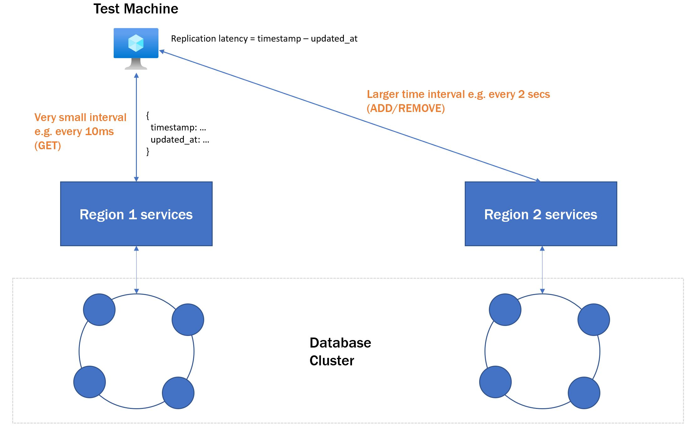
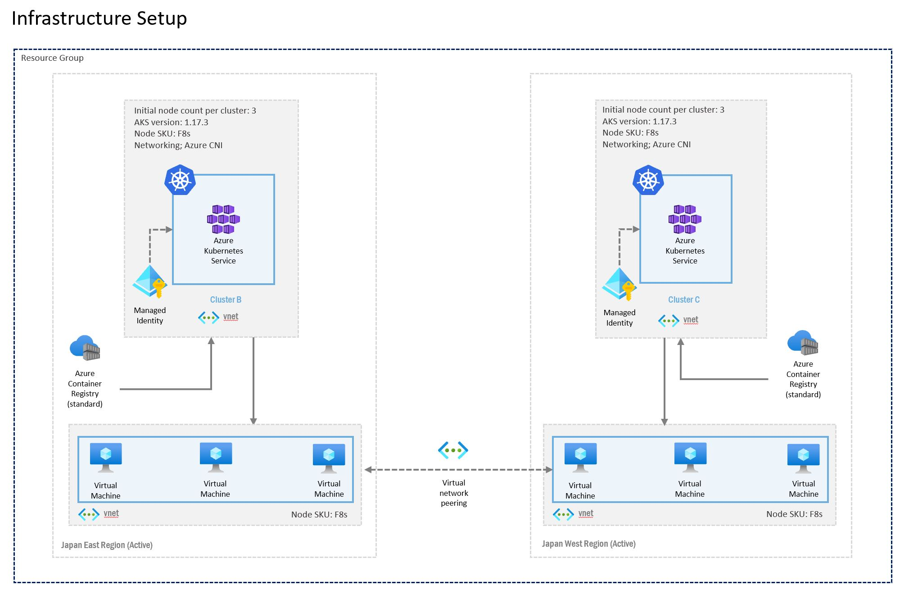

# Measuring data replication latency in a multi-region setup

This guide walks through a methodology for measuring replication lag time in a multi-region, active active scenario.

## Overview

An active-active design typically comprises of at least two nodes running the same service simultaneously to serve traffic. In a multi-region setup, traffic is distributed across servers located in data centers in different regions - for instance, US East and US West. This is generally done to load balance traffic, as well as increase availability and resilience to data center failures. In an active-active design, should one data center go down, the system as a whole would still be able to serve traffic to end users, albeit at a potentially degraded performance. 

When traffic is load balanced between multiple regions, in most cases, the same data is served from multiple regions simultaneously. This requires data to be replicated from one data center to another in a very short span of time. One metric that can be used to measure this is replication latency. Replication latency, or replication lag, is defined by the amount of time it takes for a transaction (change in db value) in one data center to reflect in another. 

In some cases, replication latency statistics could come out of the box depending on the technology used. But in cases where these metrics are not easily obtained, the following Readme proposes a methodology to measure replication latency across data centers situated in different regions. 

## Scenario

We will use a scenario where you own a game website, and each of your users has a game score. If the user performs an action, for instance completing a mission, they will be awarded points. At a very simplified level, the database would contain at least the following:

| User Id                              | Score | Updated At                |
|--------------------------------------|--------|---------------------------|
| e144dc27-08b4-4e7f-9af0-6fc42b2fa87f | 4200   | 2020-08-04T10:26:07+00:00 |
| d89d6c71-d7d2-4ae4-a041-5906cace7780 | 5100   | 2020-07-12T12:42:12+00:00 |
| 944ca193-6a90-466a-b980-e8a6c072e824 | 1500   | 2020-07-24T08:22:31+00:00 |

Let's say the game website is hosted in both Japan East and Japan West, serving all your users in Japan. In both data centers, you host services that perform operations to add points, remove points and retrieve the user's score. If you add points to a user's score, you will need to measure the time it takes for both data centers to have the same score reflected. 

While in the above example we use gaming, in reality this could be applied to many domains that use loyalty points (e.g. hotels, airlines, e-commerce websites). 

## Testing Requirements

For the above scenario, we want to emulate having a few users perform score change operations simultaneously. For instance, simulating 10 users gaining 200 points every 2 seconds to their score. We would need to log the results, and finally display a summary of the mean replication latency per user. 

So, we have the following requirements:
- Able to simulate a configurable number of users making simultaneous calls to the API 
- Be able to control the frequency of point updates/point retrievals for each user (i.e. Requests Per Second)
- Output logs needed for calculating replication latency for each operation
- Aggregate logs to generate test result summary 
- As automated as possible

## Testing Methodology

At a high level, the test retrieves the user score in a data center at a very high frequency (polling), whilst periodically calling the API (add or reduce score) in the other data center. The diagram below illustrates this.



Balance retrieval API calls should return the following information in its response at the minimum:

```js
{
    "userId": "",
    "score": "",
    "updatedAt": "", // Time the database row was last updated 
    "timestamp": "" // Database retrieval timestamp (server side)
}
```

The test would then log the get score API response, but **only when there is a change in score**. Replication latency for each operation is calculated by measuring the difference between the "timestamp" and "updatedAt" fields. 

Finally, the logs are processed and aggregated, which involves grouping by user and calculating the mean. 

## Tools used

To simulate users and polling frequency, we used Locust, a python-based, open source load testing tool. With Locust you can also easily configure the number of users to simulate, and the number of requests per second for each user. Locust also provides a nice summary of average response times of your API for each test. To enable the usage of custom test data (user ids, initial score, and points to add/remove), we used the CSVReader Locust plugin to read in a CSV containing the custom user data. 

Locust lets you define the actions/operations which your users can perform periodically. Conventionally, one would define a series of "Task" methods under the User class. When the Locust test is run, the users would be seeded and the simulated users would start performing the defined tasks. However, this poses a limitation for measuring replication latency as a user can only perform one Task at a single time - i.e. the user would have to fully complete an operation to add points to their score in Japan West, before being able to retrieve it in Japan East. Because the API response time of the add and reduce points APIs could be significantly higher, this would affect the polling interval, and also the calculated replication latency result.

To circumvent the above, we defined a User class for each operation type - i.e. there would be a User class with only a Get Points Task defined, and another separate User class with only a Add Points Task defined. This enables the score retrieval polling to be done at consistent intervals, independent of the response time on the add points operation.

Because the Locust CLI command only lets you specify one user class, you can use GNU parallel to run 2 locust commands at once. GNU parallels also lets you specify the number of cores to use on your test machine, in case you want to simulate a very large number of users. 

Once you have the logs, the aggregation logic can be done using whatever log ingestion tool was used. However, you could alternatively log the API responses out to a CSV file and use a separate python script to aggregate and summarize the data. Here is a python script that enables this, by using common data manipulation tools like numpy and pandas.

## Infrastructure Set Up
The following setup is used to host the data and microservices. The infrastructure is hosted on Azure. For data storage, Cassandra is used - the VNET-peered Virtual Machines are setup as 1 Cassandra cluster, across 2 data centers. Both of the Kubernetes clusters host identical APIs to add points, remove points and retrieve a user's score. 



Note that while Cassandra is used as the database and Kubernetes is used to host the microservices, the methodology used to measure replication latency is technology agnostic. 

## Caveats

- The response time reported by Locust will include cross region client network time (e.g. it is 10ms on average across Azure Japan East and Japan West).
- Precision of replication latency is slightly affected by GET score response time (I.e. the max frequency per second in which you can poll) 


